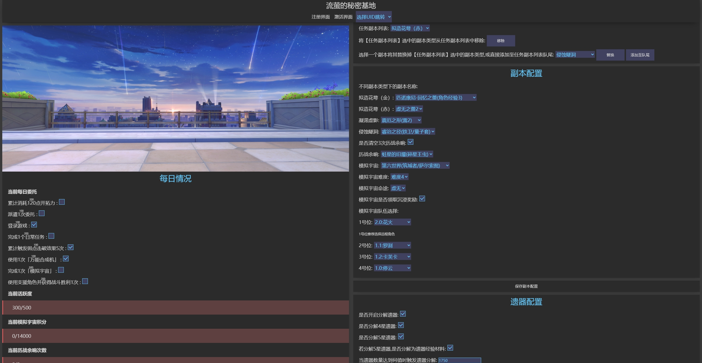
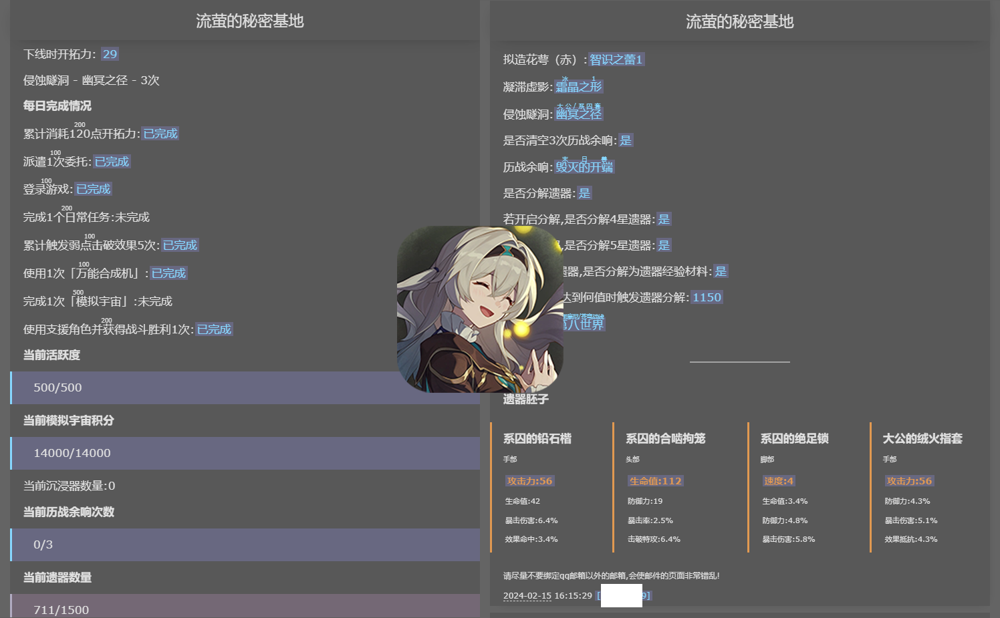

    

<h1>
HotaruAssistant · 流萤小助手 
</h1>

<h6>三月七你别再联系了,我怕流萤误会</h6>

基于March7thAssistant v1.6.2

原项目地址[https://github.com/moesnow/March7thAssistant](https://github.com/moesnow/March7thAssistant)

    
    

## 声明

- Chinese Support Only
- 本软件分为Server, Client, Updater三个应用程序。其中Server部分**不开源**,介意者勿下载,主要意在防止可能的倒狗行为,本身不会含有恶意代码,放心使用。
- 同时虽然本软件主打多账号支持,但考虑到可能对代练有利,本软件做出限制,**不支持**两个以上账号的使用。本身该软件即为我用于解决枯燥的大号小号每日任务而制作,没理由还给别人方便赚钱。(最主要的是老子拿不到钱)
- 随缘更新,没有群(但我在原作者群里),不写Changelog
- 基本不回答问题

## 预览

不一定仍是实际画面

###### WEBUI

###### SMTP

## 功能对比

功能|原版|此版
--|--|--
**多账号支持**|不好说|&check;
**遗器胚子识别**|&cross;|&check;(暂不支持模拟宇宙遗器)
遗器自动分解|&check;|&check;
清体力|&check;|&check;
每日实训|&check;|&check;
每日委托|&check;|&check;
历战余响|&check;|&check;
模拟宇宙|&check;|&check;(仅支持刷满积分)
忘却之庭|&check;|&cross;
虚构叙事|不知道|&cross;
锄大地|&check;|&cross;
消息推送|&check;|仅支持邮件
UI|QT客户端|WebUI

> 其中模拟宇宙调用的 [Auto_Simulated_Universe](https://github.com/himesamanoyume/Auto_Simulated_Universe) 项目也是为我自己适配本项目所修改的fork,非原版模拟宇宙,锄大地功能已经剔除

## 注意事项

- 必须在**PC端**以 `1920*1080` 分辨率运行游戏（不支持HDR）
- 通过使用 [远程本地多用户桌面](https://asu.stysqy.top/guide/bs.html) 以在后台使用
- 确保已安装Python 3.11.1及以上版本, 调用的模拟宇宙模块为源码运行

> 本项目用于在一个后台用户上完成所有账号的日常周常,若有锄大地等需求建议使用[原版三月七助手](https://github.com/moesnow/March7thAssistant)每个账号开一个用户单独运作,或者直接单独使用原项目仓库中提到的[原版模拟宇宙自动化](https://github.com/CHNZYX/Auto_Simulated_Universe)和[原版锄大地自动化](https://github.com/linruowuyin/Fhoe-Rail)项目

---

- 刷侵蚀隧洞时会自动检测遗器词条,满足胚子条件时自动上锁,词条过于垃圾则会自动弃置

5星遗器部位|头部|手部|躯干|脚部|位面球|连结绳
-|-|-|-|-|-|-|
3词条0双暴|弃置|弃置|胚子:双暴主词条|弃置|弃置|弃置
3词条1双暴|胚子|胚子|胚子:双暴,攻击力主词条|胚子:速度/攻击力主词条|胚子:属性伤害加成/攻击力主词条|胚子:非防御力主词条
3词条2双暴|胚子|胚子|胚子|胚子|胚子|胚子
4词条0双暴|弃置|弃置|弃置|弃置|弃置|弃置
4词条1双暴|无视|无视|胚子:双暴主词条|无视|无视|无视
4词条2双暴|胚子|胚子|胚子|胚子|胚子|胚子

## 2.0TODO

- 自定义遗器词条决策
- 适配双倍三倍奖励识别遗器
- BUG:模拟宇宙期间 不会在打完之后去领取积分奖励，导致沉浸器会积攒下来

- webui的某些样式回归为css文件而不是内嵌，例如某些link-button
- 新增不同副本切换不同队伍
- **目标:每日执行速度优化,尽可能最快速最少时间完成一次流程**
- 新增教程页面
- 识别相关改进(抄袭原版)[似乎暂时不需要]
- - ~~screens.json相关一并优化~~(抄袭原版)[似乎暂时不需要]
- 新增角色死亡处理(目前是激化尝试1,2,3,4切换角色，如果出现需要复活的界面,则跳转到传送点)
- 也许可以把当前State一起打印
- 每次操作之间间隔太久，需要继续优化[重构完成后]
- 优化:姬子试用流程可缩减[重构完成后]
- - 补充姬子试用专属重开逻辑
- 模拟宇宙改造成程序运行
- - 且需要连接到服务器,用于发送日志
- ~~更换头图至秘密基地~~(缺一个有流萤版本,等2.3)

### Universe

### Task

### State

### Update

### Socket
- [低优先级]~~Client向Server发送心跳包,同时Server也要进行回应~~,当任何一方长期未接收到心跳包时,判定对方离线并做相应处理,如Client发现Server没了,则直接中止程序

### Screen/Click
- 截图工具加上滚动条

### GameLoop

### Web

#### Web大后期

- 实现可输入的input框
- 公告新增带图片显示内容
- - 是否需要内网穿透保护页面
- 新增查看日志页，读取文件夹内日志进行查看，且每次都会对当中的日志做清除颜色代码处理？亦或者做其他用途，看情况
- 尝试实现页面串流游戏画面(类似云游戏)[纯娱乐性质想法,未检验可行性]
- 新增工具页,添加如解锁帧率等功能开关

### Notify

### Config

### Data

### v1.x低优先级

- webui显示控制台log
- 新增设置开启自动战斗继承和config项
- 当一个事件距离开始不超过1天时 记为新活动开始发送通知
- 已知问题:模拟宇宙进行过程中非正常退出时,下次上号仍会处于模拟宇宙中,此时脚本无法识别当前情景（懒得修,自己手动退出模拟宇宙）