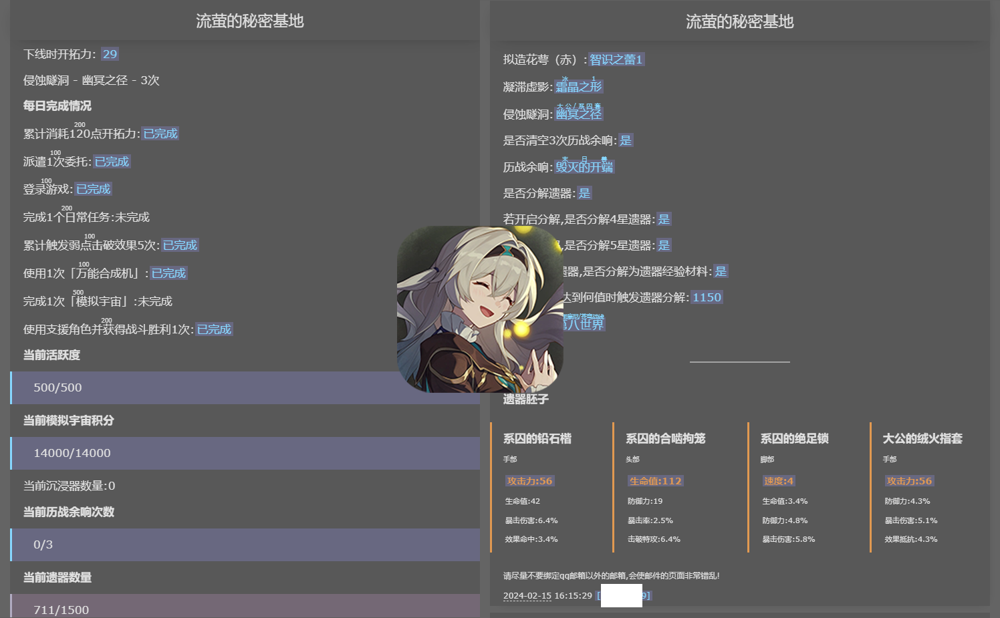

    

<h1>
HotaruAssistant · 流萤小助手 
</h1>

<h6>三月七你别再联系了,我怕流萤误会</h6>

基于March7thAssistant v1.6.2

原项目地址[https://github.com/moesnow/March7thAssistant](https://github.com/moesnow/March7thAssistant)

    
    

## 声明

- Chinese Support Only
- 随缘更新,没有群,不写Changelog,某些我未用到的功能很可能已被我破坏了代码结构已无法使用,除非影响到了我使用否则不做修复,有能力建议自己改
- 不回答任何问题,本质上是原项目经过本人改造过后的私人仓库进行了公开,业余水平,盛产屎山

## 功能对比

功能|原版|此版
--|--|--
**多账号支持**|&cross;|&check;
**遗器胚子识别**|&cross;|&check;(不支持模拟宇宙遗器)
遗器自动分解|&check;|&check;
清体力|&check;|&check;
每日实训|&check;|&check;
每日委托|&check;|&check;
历战余响|&check;|&check;
模拟宇宙|&check;|&check;(仅支持刷满积分)
忘却之庭|&check;|&cross;
虚构叙事|不知道|&cross;
锄大地|&check;|&cross;
消息推送|&check;|仅支持邮件
UI|QT客户端|WebUI
OBS录制|&cross;|&check;

> 其中模拟宇宙调用的 [Auto_Simulated_Universe](https://github.com/himesamanoyume/Auto_Simulated_Universe) 项目(为我自己适配本项目所修改的fork)，锄大地功能已经剔除

## 注意事项

- 必须在**PC端**以 `1920*1080` 分辨率运行游戏（不支持HDR）
- 通过使用 [远程本地多用户桌面](https://asu.stysqy.top/guide/bs.html) 以在后台使用
- 确保已安装Python 3.11.1及以上版本, 调用的模拟宇宙模块为源码运行

> 本项目用于在一个后台用户上完成所有账号的日常周常,若有锄大地等需求建议使用[原版三月七助手](https://github.com/moesnow/March7thAssistant)每个账号开一个用户单独运作,或者直接单独使用原项目仓库中提到的[原版模拟宇宙自动化](https://github.com/CHNZYX/Auto_Simulated_Universe)和[原版锄大地自动化](https://github.com/linruowuyin/Fhoe-Rail)项目

## 下载安装

前往 [Releases](https://github.com/himesamanoyume/HotaruAssistant/releases/latest) 下载

检测更新 双击 `Update.exe`

## 如何使用

1. 启动Server

自动打开webui，查看控制台显示的网页ip地址，记录第二个，你将可以在同一局域网环境内用电脑手机浏览器打开，远程修改配置

2. 若为第一次使用: 启动Register获取注册表

因为支持多账号登录，总不可能傻傻地再输密码，因此需要使用Register登录游戏获取注册表，之后将通过导入注册表完成快速登录。每一个uid对应一个注册表，注册表也以uid命名

3. webui激活uid配置

当获取注册表之后，此时该uid已被列入激活列表，此时你需要到webui的激活界面，填写基础配置信息，进行激活

4. 可选:在首次启动前先在webui的UID总览里修改配置

> 强烈建议开启并配置SMTP服务,收取邮件通知

5. 启动Client

此时应该能看到已激活的uid在列表中，按回车开启循环

## 脚本会做些什么?

首先不同于原版,本项目只会完成基本的日常周常

一次循环共有两个轮次,每日任务轮次,模拟宇宙轮次

按uid列表顺序执行一遍每日任务轮次,再从头执行一遍模拟宇宙轮次

### 每日任务轮次

- 只做每日,刷周本,清体力
- 清体力若选择了模拟宇宙时只兑换沉浸器,不刷其他副本,但若开启优先完成3次周本,依然先清周本

### 模拟宇宙轮次

- 检测当前积分,如果没满分,不论是否清体力选择了模拟宇宙,在该轮次时都将进行模拟宇宙并一直刷到满分,领取奖励
- 如果选择模拟宇宙作为清体力的任务,则会用体力兑换沉浸器,当沉浸器大于等于4个时,才会进行一次模拟宇宙

### 通用

- 刷侵蚀隧洞时会自动检测遗器词条,满足胚子条件时自动上锁,词条过于垃圾则会自动弃置

5星遗器部位|头部|手部|躯干|脚部|位面球|连结绳
-|-|-|-|-|-|-|
3词条0双暴|弃置|弃置|胚子:双暴主词条|弃置|弃置|弃置
3词条1双暴|胚子|胚子|胚子:双暴,攻击力主词条|胚子:速度/攻击力主词条|胚子:属性伤害加成/攻击力主词条|胚子:非防御力主词条
3词条2双暴|胚子|胚子|胚子|胚子|胚子|胚子
4词条0双暴|弃置|弃置|弃置|弃置|弃置|弃置
4词条1双暴|无视|无视|胚子:双暴主词条|无视|无视|无视
4词条2双暴|胚子|胚子|胚子|胚子|胚子|胚子

- 当遗器数量达到阈值时自动分解(前提是该UID配置中开启了允许分解遗器)
- 识别虚构叙事与忘却之庭星数层数(只识别,不打),模拟宇宙积分,每日完成情况,展示当前配置文件,获取游戏活动资讯等等并通过SMTP服务发送邮件告知
- 通过局域网WebUI后台远程调整配置

## 相关项目

HotaruAssistant 离不开以下开源项目的帮助：

- 原版三月七助手 [https://github.com/moesnow/March7thAssistant](https://github.com/moesnow/March7thAssistant)

- 原版模拟宇宙自动化 [https://github.com/CHNZYX/Auto_Simulated_Universe](https://github.com/CHNZYX/Auto_Simulated_Universe)

- OCR文字识别 [https://github.com/hiroi-sora/PaddleOCR-json](https://github.com/hiroi-sora/PaddleOCR-json)

## TODO

- ~~漏了副本~~
- ~~网页将界面跳转移到header顶部, 同时也有下方配置部分的跳转, 新增uid跳转~~

## 低优先级

- (预计v1.8.4.3之后)完成每日时截图界面与邮件一并发送防止显示完成了每日但实际上并没有的情况
- webui显示控制台log
- 新增设置开启自动战斗继承和config项
- 当一个事件距离开始不超过1天时 记为新活动开始发送通知
- 补回录制时出现致命错误依旧发送视频附件
- Bug:最后一个账号如果抛出异常进入非正常退出流程,则会直接开始下一轮循环
- Bug:模拟宇宙进行过程中非正常退出时,下次上号仍会处于模拟宇宙中,此时脚本无法识别当前情景（懒得修,自己手动退出模拟宇宙）