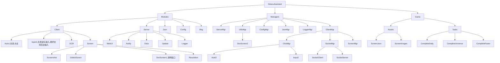
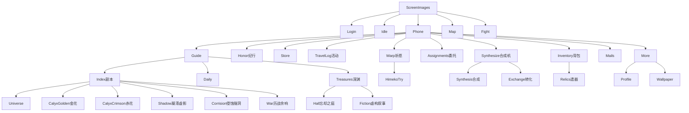

    

<h1>
HotaruAssistant · 流萤小助手 
</h1>

<h6>三月七你别再联系了,我怕流萤误会</h6>

基于March7thAssistant v1.6.2

原项目地址[https://github.com/moesnow/March7thAssistant](https://github.com/moesnow/March7thAssistant)

    
    

协议通过, 开启焦土作战

- 指重构项目

由于当初使用这个项目时本意只是稍微改改一些功能来符合我个人的使用习惯,因此代码写得十分随意,而且在这之前没有系统学习过python,直接从别的语言靠经验转过来,想写什么逻辑直接对应着去查python怎么写就怎么写了,因此这也是我觉得我这代码很屎山的主要原因

之后随着我4个多月以来越来越多地依据自身需求进行改造,同时也由于崩铁不像原神那样一成不变地积极优化,我开始觉得开发过程变得越来越麻烦

而且本项目也与原版三月七助手的代码差别开始越来越大,我已经完全不同步原版项目的更新了,因此在本项目适配崩铁2.0版本基本完善之后,我决定对本项目进行龟速的重构

> 我将...点燃大海!

以应对不断变化的崩铁自动化流程,同时也提高项目可维护性

原版三月七助手的2.0版本早已上线,而此项目的2.0版本将在重构完成后到来

> 等回到现实,记得告诉所有人,是星核猎手送了你们最后一程。

# 2.0重构

### 指导思想

- 识别/点击都以限定时间内快速重复尝试为主
- 尝试用监听相关

预期项目结构

预期游戏结构

## 声明

- Chinese Support Only
- 随缘更新,没有群,不写Changelog,某些我未用到的功能很可能已被我破坏了代码结构已无法使用,除非影响到了我使用否则不做修复,有能力建议自己改
- 不回答任何问题,原版是私人仓库,业余水平,盛产屎山

## 功能对比

功能|原版|此版
--|--|--
**多账号支持**|&cross;|&check;
**遗器胚子识别**|&cross;|&check;(不支持模拟宇宙遗器)
**遗器自动分解**|&cross;|&check;
清体力|&check;|&check;
每日实训|&check;|&check;
每日委托|&check;|&check;
历战余响|&check;|&check;
模拟宇宙|&check;|&check;(仅支持刷满积分)
忘却之庭|&check;|&cross;
虚构叙事|不知道|&cross;
锄大地|&check;|&cross;
消息推送|&check;|仅支持邮件
UI|QT客户端|WebUI
OBS录制|&cross;|&check;

> 其中模拟宇宙调用的 [Auto_Simulated_Universe](https://github.com/himesamanoyume/Auto_Simulated_Universe) 项目也是为我自己适配本项目所修改的fork,非原版模拟宇宙,锄大地功能已经剔除

## 2.0TODO

## 1.xTODO

- update.exe新增选项选择更新全体或单独更新assets
- 截图工具加上滚动条，新增透明窗口 不断显示检测区域
- 后台新增调整循环结束后配置
- 后台新增是否开启daily_himeko_try_enable,after_finish
- 更换头图至秘密基地
- 教程写明更清晰的使用步骤(从blog中移动)

## 1.x低优先级

- 新增设置开启自动战斗继承和config项
- 当一个事件距离开始不超过1天时 记为新活动开始发送通知
- 补回录制时出现致命错误依旧发送视频附件
- Bug:最后一个账号如果抛出异常进入非正常退出流程,则会直接开始下一轮循环
- Bug:模拟宇宙进行过程中非正常退出时,下次上号仍会处于模拟宇宙中,此时脚本无法识别当前情景（懒得修,自己手动退出模拟宇宙）